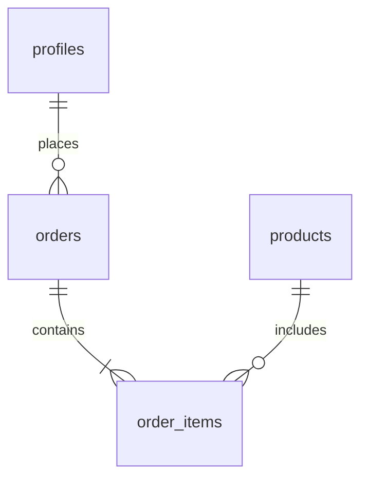

# MyTaylorZone - Premium Fashion E-commerce Platform

A modern and premium e-commerce platform tailored for the MyTaylorZone clothing brand, offering a seamless shopping experience, user-friendly design, and responsive functionality. Built with a robust tech stack to ensure scalability, performance, and security.

## 🌐 Live Link

[Vercel](https://my-talor-zone.vercel.app/) [Less Responsive]

[Netlify](https://silver-tarsier-cc0889.netlify.app/) [More Responsive]

---

## 📸 Preview


---

## 🚀 Features

### **1. Shopping Experience**
- **Category-Based Browsing**: Navigate effortlessly through various categories, making it easy for customers to find products of their choice.
- **Advanced Search with Filters**: Search functionality enhanced with filters for price, size, color, and more.
- **Real-Time Suggestions**: As users type, product recommendations dynamically appear for a faster shopping experience.
- **Quick View**: Preview product details without navigating away from the current page.
- **Detailed Product Pages**:
  - High-resolution images with zoom functionality.
  - Comprehensive size guides to assist in accurate purchases.
  - Real-time stock availability updates.
  - Display of related products to encourage additional purchases.

---

### **2. Smart Cart Management**
- **Real-Time Updates**: Instantly reflect changes in product quantities, sizes, or selections.
- **Modify Items in Cart**: Add, remove, or adjust items with ease.
- **Dynamic Price Calculation**: Automatically updates cart totals with taxes and shipping charges.
- **Multiple Shipping Options**: Customers can choose their preferred shipping method during checkout.

---

### **3. User Features**
- **Secure User Accounts**:
  - Register and log in using email and password.
  - Password recovery options for convenience.
  - Secure session management to protect user data.
- **Personal Dashboard**:
  - Track orders with real-time status updates.
  - View purchase history for reordering or record-keeping.
  - Save multiple delivery addresses for quicker checkouts.
  - Manage wishlists to save favorite items for future purchases.

---

### **4. Checkout & Payments**
- **Express Checkout**: Streamlined process to reduce cart abandonment.
- **Multiple Payment Options**:
  - Fully integrated with Stripe for secure and reliable payments.
  - Cash on delivery option for convenience.
- **Order Confirmation and Notifications**:
  - Email confirmation for every order placed.
  - Updates on order status and shipping details.

---

### **5. Design & User Experience**
- **Responsive Design**:
  - Mobile-first approach ensuring flawless performance across all devices.
  - Optimized layouts for tablets and desktops.
- **Performance Enhancements**:
  - Lazy loading for faster page load times.
  - Optimized images to minimize bandwidth usage.
  - Efficient caching strategies for repeated visits.

---

## 🛠️ Technical Stack

### **Frontend**
- **React 18**: Core framework for building a dynamic and interactive user interface.
- **TypeScript**: Enhances code quality and reduces bugs with static typing.
- **Vite**: A fast and efficient build tool for development and production.
- **React Router v6**: Manages client-side navigation seamlessly.
- **Tailwind CSS**: Utility-first CSS framework for consistent and responsive design.

### **Backend**
- **Supabase**: A robust Backend-as-a-Service (BaaS) solution:
  - **PostgreSQL**: Reliable and scalable database.
  - **Row-Level Security**: Ensures data safety at a granular level.
  - **Edge Functions**: Provides serverless execution for custom logic.
  - **Real-Time Subscriptions**: Enables live updates and synchronization.

### **Payment Integration**
- **Stripe**: Industry-standard payment processor offering:
  - Secure and PCI-compliant transactions.
  - Support for multiple payment methods.
  - Integration with webhooks for payment notifications.

---

## 🚀 Getting Started

### **Prerequisites**
- Ensure you have the following installed:
  - Node.js (v16 or later)
  - npm or yarn
  - Git for version control

### **Installation Steps**

1. **Clone the Repository**
   Clone the project to your local machine:
   ```bash
   git clone https://github.com/ayushs1214/MyTalorZone.git
   cd MyTaylorZone


2. **Install Dependencies**
   Install required packages using npm or yarn:
   ```bash
   npm install
   ```

3. **Setup Environment Variables**
   Create a `.env` file in the root directory and add the following:
   ```env
   VITE_SUPABASE_URL=your_supabase_url
   VITE_SUPABASE_ANON_KEY=your_supabase_anon_key
   VITE_STRIPE_PUBLIC_KEY=your_stripe_public_key
   ```

4. **Run the Development Server**
   Start the local server for development:
   ```bash
   npm run dev
   ```

5. **Build for Production**
   Prepare the application for deployment:
   ```bash
   npm run build
   ```

---

## 📁 Project Structure

```
MyTaylorZone/
├── src/
│   ├── components/          # Reusable UI components
│   │   ├── common/          # Shared components (e.g., buttons, modals)
│   │   ├── layout/          # Layout-specific components (e.g., navbar, footer)
│   │   └── features/        # Feature-specific components (e.g., cart, wishlist)
│   ├── context/             # React Context providers for global state
│   ├── hooks/               # Custom React hooks for reusable logic
│   ├── lib/                 # Third-party integrations (e.g., Stripe, Supabase)
│   ├── pages/               # Components corresponding to app routes
│   ├── styles/              # Global CSS and Tailwind configurations
│   ├── types/               # TypeScript type definitions
│   └── utils/               # Helper functions and utilities
├── public/                  # Static assets (e.g., images, fonts)
└── supabase/                # Database configurations and scripts
```

---

## 🗄️ Database Schema

### **Core Tables**
- **profiles**: Stores user data, preferences, and authentication details.
- **products**: Contains information about products, including inventory, pricing, and categories.
- **orders**: Tracks customer orders, payment status, and shipping details.

### **Relationships**


---

## 🤝 Contributing

### **How to Contribute**
1. Fork the repository.
2. Create a new feature branch:
   ```bash
   git checkout -b feature/new-feature
   ```
3. Make changes and commit:
   ```bash
   git commit -m "Add new feature"
   ```
4. Push changes to your fork:
   ```bash
   git push origin feature/new-feature
   ```
5. Submit a pull request for review.

### **Coding Standards**
- Use TypeScript best practices.
- Keep components modular and reusable.
- Write tests for new features and functions.
- Maintain clear and concise commit messages.

---

## 📄 License

This project is licensed under the MIT License. See [LICENSE](LICENSE) for details.

---

## 🙏 Acknowledgments

- Inspired by leading e-commerce platforms for UI/UX.
- Icons provided by [Lucide](https://lucide.dev).
- Images sourced from [Unsplash](https://unsplash.com).
- Special thanks to the open-source community for tools and libraries.

---

## 📞 Support

For support, please contact **ayushietetsec@gmail.com**.
```

Made with ❤️ by Ayush Singh
# flower
